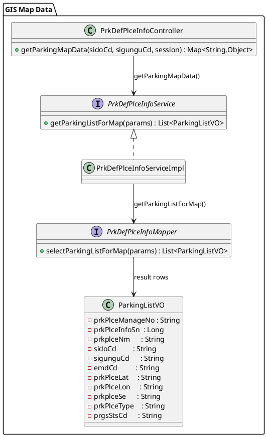

# `/prk/parking-map-data` 설계 요약

지도(GIS)에서 주차장 마커 데이터를 조회하기 위한 전용 REST 엔드포인트 정리.

## 개요
- **엔드포인트**: `GET /prk/parking-map-data`
- **역할**: 지도에 표시할 주차장 목록을 반환. 좌표(lat/lon)가 있는 데이터만 조회하여 마커/클러스터링에 사용.
- **호출 주체**: `parkingmap.jsp`(GIS 뷰) 스크립트.

## 요청 파라미터
- `sidoCd` (optional): 시도 코드. 없으면 전체.
- `sigunguCd` (optional): 시군구 코드. 없으면 시군구 필터 미적용.
- **세션**: `userBizList`를 컨트롤러에서 읽어 params에 포함해, 로그인 사용자의 사업 범위로 결과 제한.
- 컨트롤러에서 키 호환을 위해 `sido`, `sigungu`에도 동일 값 세팅.

## 처리 흐름 (컨트롤러)
1) 공백 제거 후 `sidoCd`, `sigunguCd`를 params에 주입.
2) 세션 `userBizList`가 있으면 params에 추가.
3) `PrkDefPlceInfoService.getParkingListForMap(params)` 호출 → Mapper `selectParkingListForMap` 실행.
4) 결과를 JSON으로 반환.

## 응답 스키마
```json
{
  "success": true,
  "list": [
    {
      "prkPlceManageNo": "...",
      "prkPlceInfoSn": 123,
      "prkplceNm": "...",
      "sidoCd": "...",
      "sigunguCd": "...",
      "emdCd": "...",
      "prkPlceLat": "37.123",
      "prkPlceLon": "127.123",
      "prkplceSe": "1",
      "prkPlceType": "1|2|3",
      "prgsStsCd": "...",
      "...": "기타 조회 필드"
    }
  ],
  "totalCount": 1
}
```
- 실패 시 `success=false`, `message`, `list=[]`, `totalCount=0`.

## UI 사용 패턴
1) **초기 로드**: 지도 최초 진입 시 호출해 기본 마커 세팅.  
2) **필터 적용**: 검색 패널에서 시도/시군구 변경 후 재호출 → 마커/클러스터 갱신.  
3) **상세 진입 연계**: 마커/리스트 클릭 시 `/prk/parkinglist`로 이동하며 `openDetailId`·`parkingType` 파라미터 또는 세션스토리지로 상세 탭 오픈.

## 필요 클래스 다이어그램 (map-data 경로만)
- 컨트롤러: `PrkDefPlceInfoController` — `getParkingMapData(sidoCd, sigunguCd, session)`
- 서비스: `PrkDefPlceInfoService` / 구현 `PrkDefPlceInfoServiceImpl` — `getParkingListForMap(params)`
- 매퍼: `PrkDefPlceInfoMapper` — `selectParkingListForMap(params)`
- VO: `ParkingListVO` — 좌표/식별자/행정구역/상태 필드 포함


